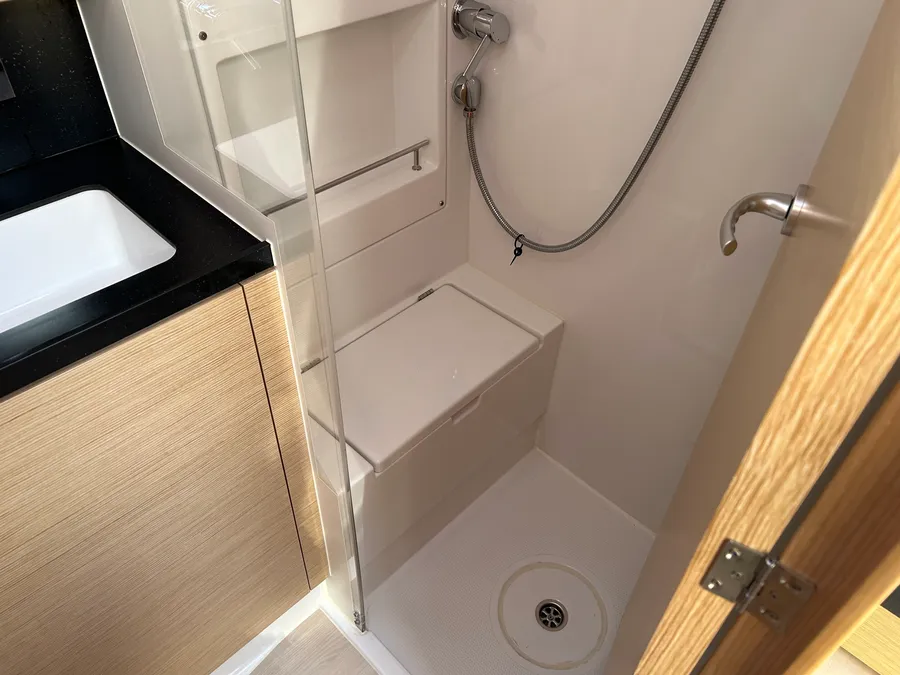

# Типичный класс яхты

Мы арендуем **лодки** в чартерной компании, рассчитанные на 8-10 человек. Ниже представлен типичный класс яхты, которую мы используем:

## Основные характеристики

### Каюты
- **Количество:** 4-5 кают
- **Кровати:** Двухспальные кровати

  
*Пример каюты на 2-х человек*

### Кают-компания
- **Оснащение:**
  - Диван
  - Кухонный гарнитур с необходимой техникой и посудой

  
*Кают-компания*

### Санузлы (Гальюны)
- **Количество:** 2-4 туалета с душем

  
*Гальюн*

### Дополнительные помещения
- **Душевые:** Иногда душ совмещен с туалетом

  
*Душ (опционален, иногда совмещен с туалетом)*

## Внешний вид и типы яхт

### Bavaria Cruiser 46
  
*Bavaria Cruiser 46*

### Классический вариант яхты

*Классический вариант яхты*

## Дополнительная информация

Примерный класс яхты и детальное описание можно найти в [этом объявлении](https://www.boataround.com/ru/yachta/jeanneau-sun-odyssey-490-senorita?checkIn=2024-09-07&checkOut=2024-09-14){:target="_blank"}.

